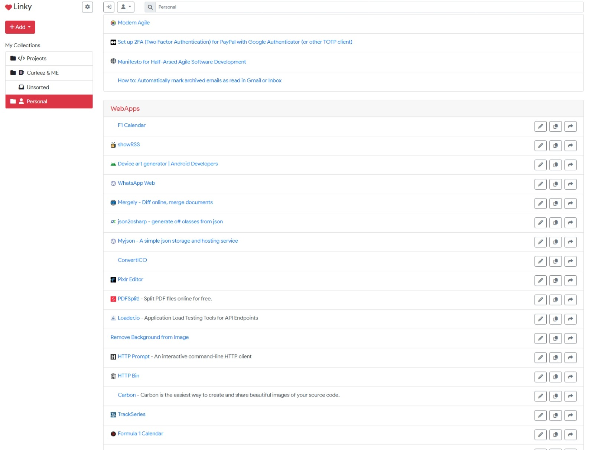

# Linky: Online bookmark manager

Easy straight-forward online bookmark manager. Use the hosted version at https://linky.sboulema.nl or self-host Linky.

## Features
- Sync bookmarks using Firebase
- Unlimited nested folders
- Customizable bookmark icons
- Tagging bookmarks
- Searching bookmarks
- Exporting bookmarks to HTML
- Exporting bookmarks to JSON

## Self-hosted
`docker pull sboulema/linky`

## Browser extensions

### Google Chrome
[Google Chrome Webstore](https://chrome.google.com/webstore/detail/linky-extension/pghdabpagojegpfplckdbnlalpgidikc)

### Mozilla Firefox
[Firefox add-ons](https://addons.mozilla.org/addon/linky-extension/)

## Building
- npm install
- npm run gulp

### Building the browser extension
- npm install
- npm run extension